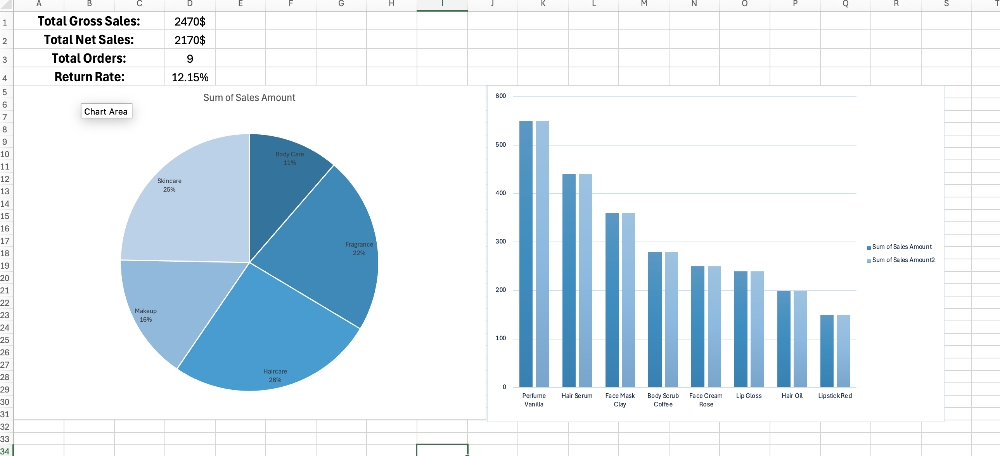

# Cosmetics Brand Sales Data Cleaning & Analysis

## Project Overview 
This project focuses on cleaning, validating, and analyzing raw cosmetics sales data using Microsoft Excel. The objective was to transform inconsistent and incomplete business data into a clean, structured dataset suitable for reporting and decision-making.

The project simulates a real-world business scenario where raw operational data requires cleaning before it can be used for meaningful analysis.

## Business Problem
Businesses often collect sales data from multiple sources, which can lead to:

- Missing values
- Duplicate records
- Inconsistent formatting
- Invalid entries
- Poor data quality

These issues reduce the accuracy of reports and make business decisions less reliable.

This project demonstrates a complete data-cleaning workflow to improve data quality before analysis.
## Project Objectives
- Clean and standardize raw sales data
- Improve data accuracy and consistency
- Document identified data quality issues
- Prepare the dataset for analysis
- Generate business insights using Excel
- Build an interactive dashboard
## My Process 
During this project, I:

- Cleaned and standardized the raw sales dataset.
- Corrected inconsistent date formats and text values.
- Handled missing and invalid data using appropriate cleaning techniques.
- Created a Data Quality Log to document identified issues and applied fixes.
- Organized the dataset into a structured format for analysis.
- Performed business calculations using Excel formulas.
- Built Pivot Tables to summarize key business metrics.
- Developed summary reports to support business performance analysis.
- Designed an interactive dashboard to present business insights.

## Tools & Technologies
- Microsoft Excel
- Excel Tables
- Pivot Tables
- Excel Formulas
- Data Validation
## Dataset Overview

The dataset contains order-level sales information, including:

- Order ID
- Product Name
- Category
- Size
- Price
- Quantity
- Customer Name
- City
- Order Date

The data was intentionally designed with multiple quality issues such as inconsistent formats, missing values, invalid entries, and incomplete records to simulate a real-world data cleaning scenario.

## Project Files 
- **Cosmetics_Sales_Cleaned_Dataset_&_Dashboard.xlsx** – Main Excel workbook containing the cleaned dataset, calculations, Pivot Tables, and dashboard.
- **Cosmetics_Sales_Data_Cleaning_Analysis_Report.pdf** — Project documentation and summary report.
- **screenshots/** – Images showing the dataset before cleaning, after cleaning, and identified data quality issues.

## Skills Demonstrated

- Data Cleaning
- Data Validation
- Data Analysis
- Data Organization
- Microsoft Excel
- Pivot Tables
- Dashboard Design
- Business Reporting
- Analytical Thinking
- Attention to Detail

## About This Project

This project was created as part of my Data Analytics portfolio to demonstrate practical skills in data cleaning, business reporting, and Excel-based analysis using a realistic sales dataset in data cleaning, validation, business analysis, Pivot Table reporting, and dashboard development using a realistic sales dataset.
